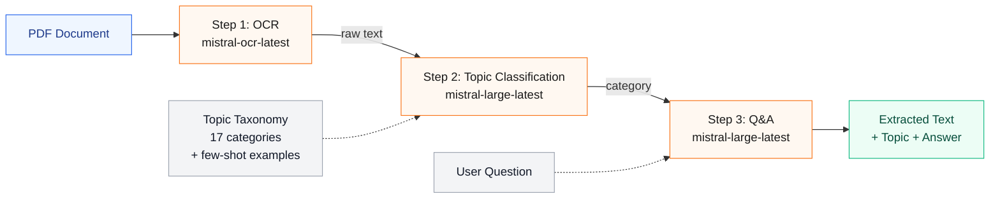
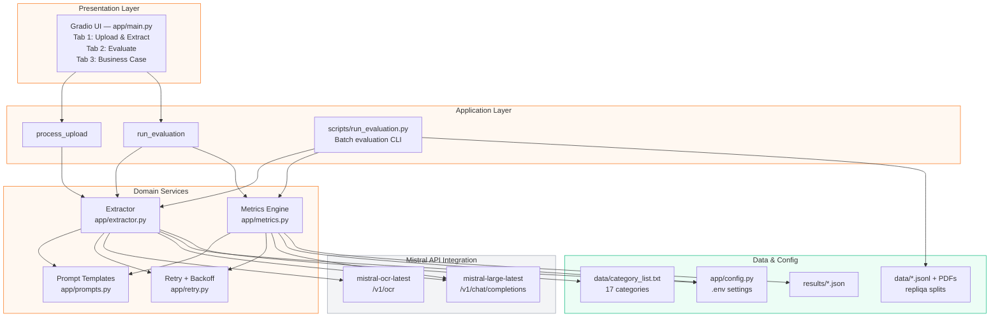
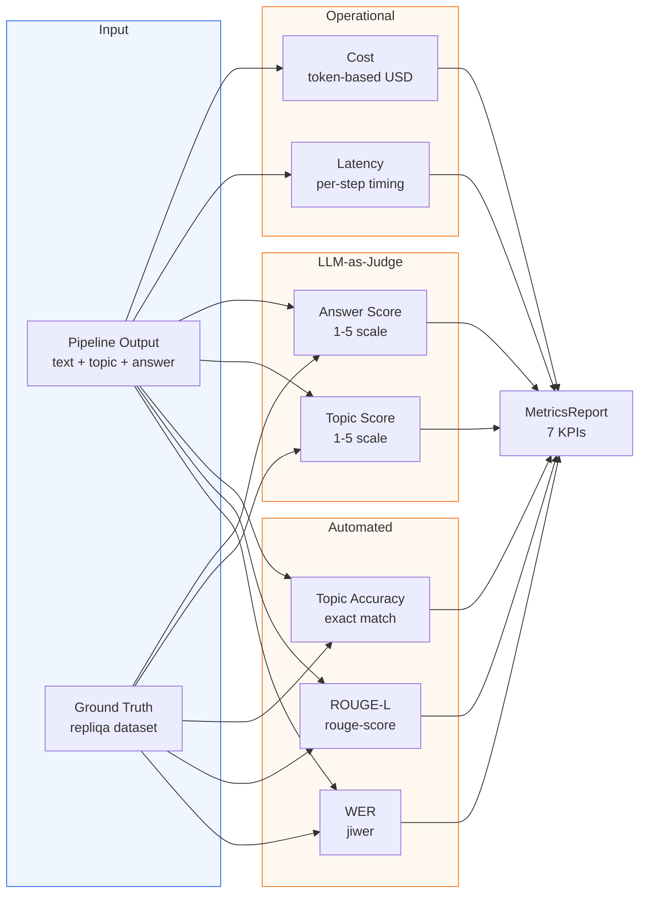

# Mistral-Lens

Document intelligence pipeline built exclusively on **Mistral AI** models. Extracts structured information from PDF documents — text, topic classification, and question answering — evaluates extraction quality against ground truth, and presents a business case versus incumbent solutions.

## Benchmark Results

Evaluated on **15 unseen documents** from the [ServiceNow/repliqa](https://huggingface.co/datasets/ServiceNow/repliqa) evaluation set (`repliqa_3`):

| Metric | Target | Result | Status |
|--------|--------|--------|--------|
| WER (Word Error Rate) | < 0.15 | **0.017** | 9x better than target |
| ROUGE-L (Text Fidelity) | > 0.80 | **0.999** | Near-perfect |
| Topic Accuracy (exact match) | > 80% | **93.3%** | Exceeds target |
| Topic Score (LLM judge) | > 4.0/5 | **4.9/5** | Excellent |
| Answer Score (LLM judge) | > 4.0/5 | **4.9/5** | Excellent |
| Latency | — | **7.1s/doc** | Real-time |
| Cost per document | — | **$0.004** | 750x cheaper than incumbent |

## Architecture

### Pipeline Flow

The extraction pipeline processes documents through three sequential stages, each powered by a Mistral model:



**Step 1 — OCR**: Converts PDF pages to raw text using `mistral-ocr-latest`. Documents are base64-encoded and sent to the `/v1/ocr` endpoint. Multi-page PDFs are concatenated.

**Step 2 — Topic Classification**: Classifies the extracted text into one of 17 predefined categories using a **few-shot taxonomy prompt**. The prompt includes category definitions, disambiguation guidelines for confusable categories (e.g., "News Stories" vs "Local News"), and 4 labelled examples. This approach improved exact-match accuracy from 73.3% (zero-shot) to 93.3% (few-shot) without requiring fine-tuning.

**Step 3 — Q&A Extraction**: Given an optional user question, generates a 2–5 sentence answer grounded solely in the document text.

### Component Architecture



Key design decisions:
- **Extractor and Metrics are independent** — no coupling between extraction and evaluation logic.
- **Retry with exponential backoff** — all API calls use a shared retry wrapper (max 10 retries, jitter, handles 429/5xx).
- **Taxonomy loaded at import time** — `data/category_list.txt` is read once; the few-shot prompt is built dynamically from it.

### Evaluation Pipeline



The evaluation engine computes **7 metrics** across three categories:
- **Automated text metrics**: WER (word error rate, lower is better) and ROUGE-L (text fidelity, higher is better) — compare OCR output against ground truth text.
- **LLM-as-judge**: Topic and answer quality scored on a 1–5 scale by `mistral-large-latest` using structured JSON rubrics. Topic accuracy is also measured via exact string match against the ground truth category.
- **Operational metrics**: Per-document latency (broken down by OCR, topic, and Q&A steps) and cost (estimated from token usage and Mistral API pricing).

## How It Works

### Topic Classification Strategy

The dataset contains 17 topic categories. Several are semantically close (e.g., "News Stories" vs "Local News" vs "Local Politics and Governance"), which makes zero-shot classification unreliable.

The solution uses a **few-shot taxonomy prompt** with three components:

1. **Category list** — all 17 categories presented as a closed set.
2. **Disambiguation rules** — explicit guidelines for confusable categories (e.g., "When a document covers a major news event, even if it mentions a specific city, classify it as 'News Stories'").
3. **Few-shot examples** — 4 labelled document snippets, one per confusable category, drawn from the development set.

This approach achieved **93.3% exact-match accuracy** on the held-out evaluation set, up from 73.3% with a zero-shot prompt. The single remaining error is a borderline case (a Jakarta election article classified as "Local Politics" instead of "News Stories").

A fine-tuning pipeline is also prepared (`scripts/build_finetune_dataset.py`, `scripts/run_finetune.py`) but was not needed since the few-shot prompt already exceeds the 80% target.

### Evaluation Strategy

The pipeline is validated using a **train/test split** approach:

- **Development set** (`repliqa_0`, 50 documents): Used for prompt engineering and pipeline tuning. All design decisions were validated here.
- **Evaluation set** (`repliqa_3`, 15 documents): Held out during development. All benchmark numbers in the Business Case come from this set.

This separation ensures that reported metrics reflect generalisation, not overfitting to the development data.

### Business Case

Cost comparison versus a typical incumbent document processing solution:

| Metric | Incumbent | Mistral-Lens | Improvement |
|--------|-----------|-------------|-------------|
| Cost per page | $0.75 | ~$0.001 | **750x cheaper** |
| Cost per document (4 pages) | $3.00 | $0.004 | **750x cheaper** |
| OCR accuracy (WER) | ~15% error | 1.7% error | **9x better** |
| Text fidelity (ROUGE-L) | ~85% | 99.9% | **Near-perfect** |
| Processing time | Minutes | 7 seconds | **Real-time** |
| Q&A capability | None | 4.9/5 | **New capability** |

## Quick Start

```bash
# 1. Install dependencies
pip install -r requirements.txt

# 2. Configure API key
cp .env.template .env
# Edit .env and set MISTRAL_API_KEY=your_key_here

# 3. Download the repliqa dataset
python scripts/download_dataset.py

# 4. Launch the Gradio UI
python app/main.py
# Opens at http://localhost:7860

# 5. Run batch evaluation on the evaluation set
python scripts/run_evaluation.py --split repliqa_3 --limit 75

# 6. Run tests
pytest tests/ -m "not integration"
```

## Project Structure

```
app/
├── config.py          # Runtime settings via pydantic-settings (.env)
├── retry.py           # Exponential backoff with jitter (max 10 retries)
├── prompts.py         # All prompt templates (topic, Q&A, LLM-judge rubrics)
├── extractor.py       # 3-step pipeline: OCR → Topic → Q&A
├── metrics.py         # WER, ROUGE-L, topic accuracy, LLM-as-judge
├── utils.py           # Shared utilities (PDF encoding, JSON I/O, timestamps)
└── main.py            # Gradio UI (3 tabs) + Business Case + Mistral CSS theme

scripts/
├── download_dataset.py         # Download repliqa splits + PDFs from HuggingFace
├── run_evaluation.py           # Batch evaluation pipeline (generates benchmark numbers)
├── inspect_topics.py           # Analyse topic distribution across splits
├── build_finetune_dataset.py   # Generate fine-tuning JSONL from repliqa
└── run_finetune.py             # Launch Mistral fine-tuning job with preflight checks

docs/
├── ARCHITECTURE.md             # Detailed system architecture
├── DECISIONS.md                # Architecture decision records
├── diagrams/                   # Mermaid source + rendered PNG/SVG diagrams
└── Project Documentation/      # Functional specs, technical docs

tests/
└── test_extractor.py           # Unit + integration tests

data/                           # Downloaded at runtime (gitignored)
├── repliqa_0.jsonl             # Development split (50 docs)
├── repliqa_3.jsonl             # Evaluation split (15 docs)
├── category_list.txt           # 17 topic categories (taxonomy)
└── pdfs/                       # Downloaded PDF documents
```

## Models Used

| Model | Purpose | API Endpoint |
|-------|---------|-------------|
| `mistral-ocr-latest` | PDF to text extraction | `/v1/ocr` |
| `mistral-large-latest` | Topic classification, Q&A, LLM-as-judge | `/v1/chat/completions` |

## Documentation

- [ARCHITECTURE.md](docs/ARCHITECTURE.md) — Full system architecture, metrics breakdown, cost analysis
- [DECISIONS.md](docs/DECISIONS.md) — Architecture decision records
- [Diagrams](docs/diagrams/) — Flow and component diagrams (Mermaid + PNG/SVG)
