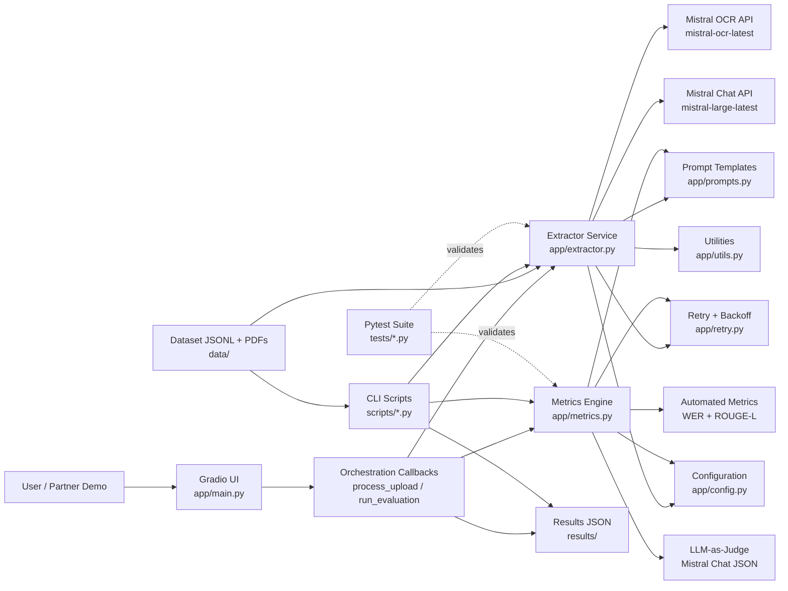

# Mistral-Lens Architecture Diagram

## Editable Source
- `mistral_lens_architecture.mmd`

## Mermaid View

```mermaid
flowchart LR
  U[User / Partner Demo] --> UI[Gradio UI\napp/main.py]
  UI --> ORCH[Orchestration Callbacks\nprocess_upload / run_evaluation]
  ORCH --> EX[Extractor Service\napp/extractor.py]
  EX --> OCR[Mistral OCR API\nmistral-ocr-latest]
  EX --> CHAT[Mistral Chat API\nmistral-large-latest]
  EX --> PROMPTS[Prompt Templates\napp/prompts.py]
  EX --> RETRY[Retry + Backoff\napp/retry.py]
  EX --> CFG[Configuration\napp/config.py]
  EX --> UTILS[Utilities\napp/utils.py]
  ORCH --> MET[Metrics Engine\napp/metrics.py]
  MET --> AUTO[Automated Metrics\nWER + ROUGE-L]
  MET --> JUDGE[LLM-as-Judge\nMistral Chat JSON]
  MET --> PROMPTS
  MET --> RETRY
  MET --> CFG
  DS[Dataset JSONL + PDFs\ndata/] --> EX
  DS --> SCRIPTS[CLI Scripts\nscripts/*.py]
  SCRIPTS --> MET
  SCRIPTS --> EX
  ORCH --> RES[Results JSON\nresults/]
  SCRIPTS --> RES
  T[Pytest Suite\ntests/*.py] -. validates .-> EX
  T -. validates .-> MET
```
